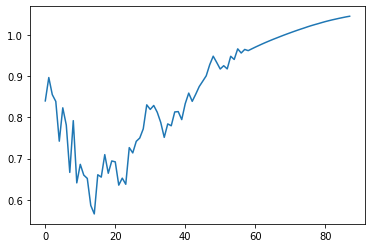

## Stock Price Prediction-LSTM

- This Project is predicting stocks for AAPL companiy with an error of less than 5% using LSTM Networks.
- I have not used pre-built models. I have trained LSTM NN models for the company .
- The data considered here is of 5 years for all companies. From (27 May,2015) to (22 May,2020)
- From the dataset we have only used the closing price for our prediction.

## Prerequisites
- Python 3.5 or higher
- NumPy
- Pandas
- scikit-learn
- TensorFlow (optional)

## Installation

To install the required packages, run the following command:

```sh
pip install numpy pandas scikit-learn tensorflow
```

## Usage

To run the code, run the following command:
```sh
python stock3-final.py
```


I have developed the code in following steps:
(1) Firstly I have impported the dataset and split the data using training and testing data

(2) Then I have created a function to store the data in form of time steps.

(4) Then I have created function to 
	build the model, select the best model, select the hyper parameters, predict the output,
	show the graph for the output etc.
	

 	We are training our model on different layers of RNNs listed below : 
	(a) Bidirectional LSTM layer (output size based on X input sequence length)
    (b) Fully connected layer (output based on input sequence length)
   	

    This module also checking for the best combination of learning rate and 
    makes final module considering the best hyper parameters.


(5) Then at last, I have calculated error and accuracy of our model and visualised our predicted output with the original output.





